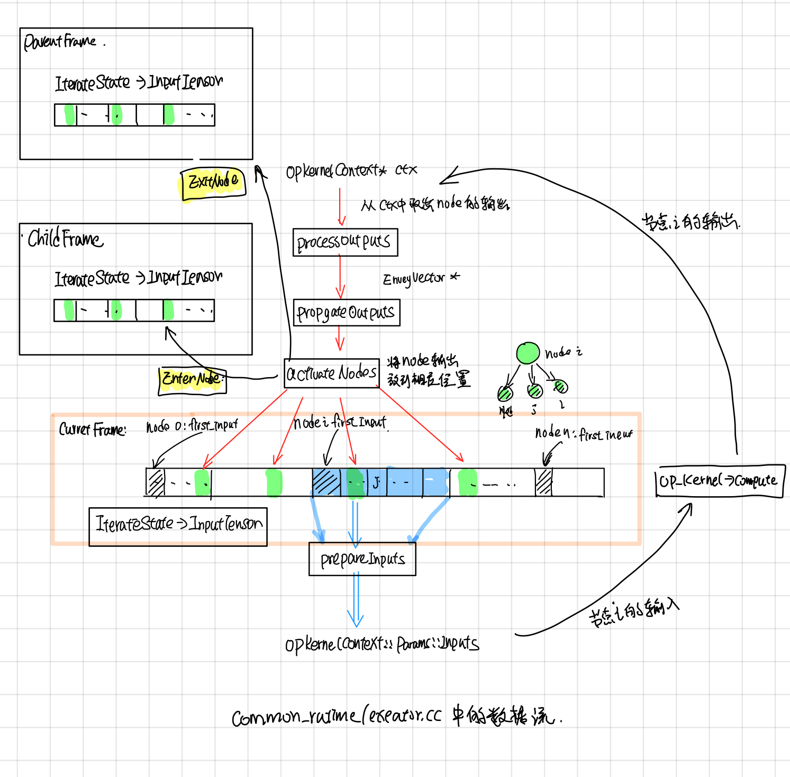

Tensorflow Graph Executor
-------------------------
## 摘要
Tensorflow中的graph执行示意图如下(图片来自[tensorflow-talk-debugging](https://wookayin.github.io/tensorflow-talk-debugging/#1))。无论单机版的(direct session)还是分布式版(GRPC, MPI, RMDA等）都先会对graph先划分成子图subgraph, 然后每个subgraph会交给一个execturo去执行。

本文主要分析了executor在执行sugraph时，node的输入输出数据和node的执行状态是如何保存的，以及Node执行的调度，最后分析了control flow 节点的执行逻辑。

在读这部分代码的时候，我想如果自己从头写这部分代码的话，需要解决那些问题，然后列了下面几个基本的问题

1. 怎么更新判断某个node是否可以执行的？
2. 每个node的输出放在哪儿，节点的输入去哪儿取？
3. 最开始从哪些节点开始执行？怎么样才算整个图执行完成了？
4. node之间如何并行地执行？

后来在[1]中发现节点还有Switch, Merge, IterNext, Enter, Exit 五个flow control node，用来实现while循环，为此tensorflowe引入了frame的概念，可以粗略的认为和函数调用一样吧, 在遇到Enter node的时候，就新建一个child frame，把inputs(类似于函数函数调用时候参数入栈)一样，forward到child frame中，在遇到Exit node，就把输出放到parent frame 中(类似于将函数的return值入栈)。

## Executor中数据流程

### ExecutorImpl::Initialize

在ExecutorImpl::Initialize中，对于graph中的每个node, 创建对应的NodeItem, 主要包含了三块：

1. 调用params.create_kernal, 创建nodeItem->kernal.
2. 记录nodeItem.input_start, input_start 是该node在它所属frame的input_tensors中的偏移index, 这个在后面的ProcessInputs和ProcessOutputs中会用到。
3. 创建node对应的pending_id， pending_id用于找到记录它执行状态的pendingCount, 这个在后面的ActiveNode中会用到.

在BuildCtronlFlow中会建立好framename之间的父子关系, frameInfo是frame的静态信息（对应着执行时候的FrameState动态信息），并且建立了从node id找到node所属frame name的映射关系，包含了frame中的total inputs, 这个frame所包含的node.

### ExecutorImpl::Process

## ExecutorImpl::RunAsync

## Control Flow

未完待续

## 参考

1. [Tensorflow control flow implemention]
2. [tensorflow-talk-debugging](https://wookayin.github.io/tensorflow-talk-debugging/#1)
